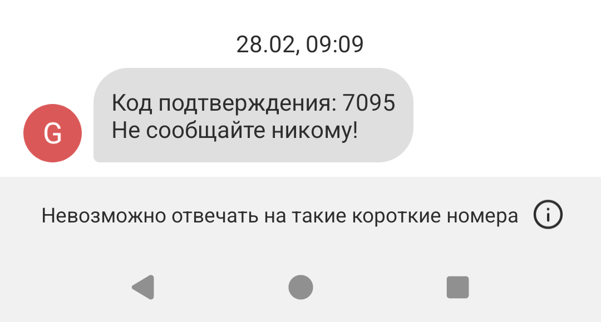
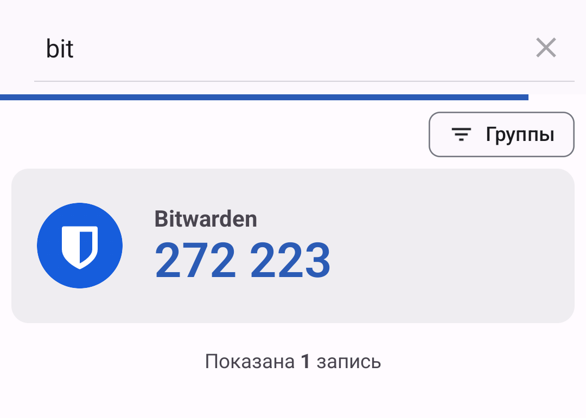
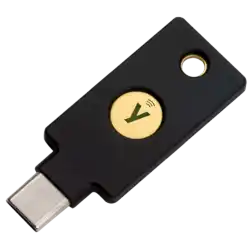

# Двухфакторная аутентификация

Мы используем пароли для защиты наших онлайн аккаунтов. К сожалению, их можно угадать, украсть, взломать. Когда мы говорим о безопастности онлайн аккаунтов, нельзя не поговорить о двух факторной аутентификации.

Двух факторная аутентификация (two-factor authentication или коротко 2FA) усиливает безопастность онлайн аккаунтов путем добавления дополнительного действия при авторизации. Дополнительное действие запрашивает у вас информацию, которая есть только у вас (ну или должна быть в теории).

Двух факторную аутентификацию также называют мульти-факторная, двух-шаговая и т.д.), далее здесь будет написанно 2FA.

# Варианты 2FA

Рассмотрим несколько самых популярных и широко используемых методов 2FA.

## Хорошая опция: код через СМС

<figure markdown="span">
   { width="400" }
  <figcaption>Пример 2ФА через СМС</figcaption>
</figure>

Когда вы устанавливаете 2FA многие сервисы позволяют вам использовать ваш номер телефона, как способ получения дополнительноог кода. Когда вы входите в свой аккаунт, вам приходит смс с кодом.

СМС самый простой способ 2FA, но очень зависящий от сотовой связи и номера телефона. Если у вас не будет связи или вы будете в другой стране и у вас не будет возможности получить СМС, в аккаунт зайти не будет возможности.

Также стоит упомянуть, что злоумышленники могут просто перевыпустить или клонировать вашу сим-карту и начать получать на неё все ваши коды. В любом случае, лучше использовать хоть какой-то способ 2FA, чем не использовать его совсем. 

Вывод: обязательно включаем, если нет других способов. 

## Вариант получше: приложение аутентификации

<figure markdown="span">
   { width="400" }
  <figcaption>Пример 2ФА через приложение</figcaption>
</figure>

Некоторые сервисы позволяют вам настроить получение временных кодов через мобильное (или десктопное) приложение. Есть большой выбор приложений, с нашими рекомендациями вы можете ознакомиться на [этой]() странице.

> Это вам знать не обязательно, но интересно.
> 
> Такие приложения используют алгоритм TOTP (Time-based One-Time Password, можно перевести как одноразовые пароли основанные на ВРЕМЕНИ). Время здесь особенно важно, потому что оно является параметром создания одноразовых кодов. Обычно пароли меняются каждые 30 секунд.
> 
> При регистрации этого способа аутентификации на каком либо сервисе, вам нужно с помощью приложения аутентификации сканировать QR-код. Приложение считает все параметры и создаст генератор временных паролей. Идентичный генератор будет работать независимо на сервере. При попытке войти в аккаунт, сервис запрашивает у вас ваш временный пароль и сравнивает его со значением своего собственного генератора. Если они совпадают, вы можете зайти на сервис.
> 
> Как вы уже поняли, время здесь играет важную роль и теоретически у нас появляется проблема: при рассинхронизации времени в вашем телефоне и времени на сервере более чем на 30 секунд, вы не сможете зайти в ваш аккаунт. Практически же, если телефон автоматически синхронизирует время и часовой пояс, никаких проблем никогда не возникает. 

В отличии от СМС, приложениям аутентификации не требуется доступ к мобильной сети или интернету. Также, если вы не синхронизируете данные таких приложений через облако, у мошенников почти нет возможностей получить эти коды (Разве что вы попадетесь на фальшивый сайт и сами введете этот код). 

## Лучший вариант: ключ безопастности

<figure markdown="span">
   { width="200" }
  <figcaption>Ключ Yubikey</figcaption>
</figure>

Сейчас ключи безопастности - это самый безопастный и эффективный способ использования 2FA. Ключ безопастности - это физическое USB устройство (размером маленькую флэшку), с помощью которого вы можете войти в свой аккаунт.

В отличии от предыдущих двух вариантов, этот не является бесплатным. Ключ безопастности придется купить. Самый популярный вариант - ключи от [Yubikey](https://yubikey.me/ru/) стоят от 25 до 100 евро. 

Ключи безопастности не так широко распространены, как приложения аутентификации. Однако их тоже поддерживает большое количество крупных сайтов. 

Всю информацию из этой статьи можно представить в виде одной картинки:

картинка со спанчбобом

## Выводы

Использовать вторую ступень авторизации необходимо всегда. Если сервис поддерживает СМС - ставим СМС. Если сервис поддерживает приложения аутентификации, ставим приложение. Если вы способны потратить пару тысяч рублей на ключ безопастности, покупаем ключ. Для большинства же хватит бесплатного приложения.

Вот [тут]() скоро будет небольшая инструкция по выбору приложения аутентификации, его настройке и бэкапу данных.
