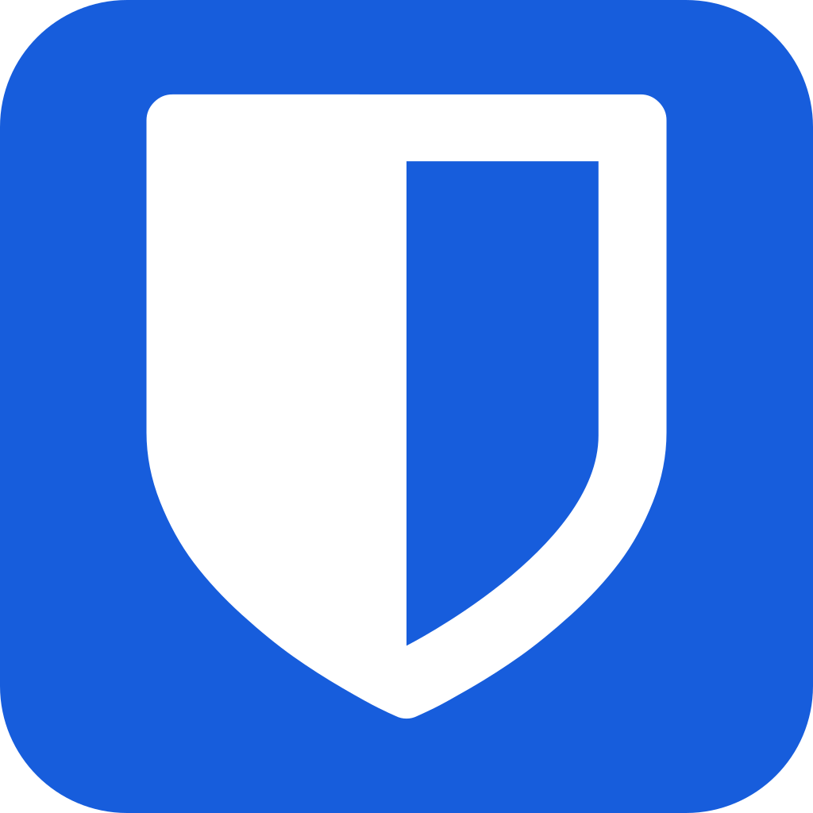
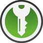

## Что такое менеджер паролей?

Менеджер паролей - это специальная программа, которая может не только надежно хранить ваши пароли, но и генерировать для вас сложные и безопасные пароли. 

Вам не нужно будет запоминать пароль от каждого сайта или использовать один и тот же пароль для нескольких сайтов. 

Во многих менеджерах паролей имеется возможность проверять ваши пароли и адреса email по слитым базам данных.

---

## **Почему это важно?**

Сложный и случайный пароль является первым барьером, который злоумышленнику нужно преодолеть, чтобы получить доступ к вашему аккаунту.

К сожалению самое большое [количество утечек паролей в 2021](https://d-russia.ru/rossija-lider-2021-goda-po-chislu-utechek-parolej-issledovanie.html) году произошло в России. 

В данной ситуации, каким бы сложным не был ваш пароль, если он оказался в слитой баззе данных, его нужно менять. В мониторинге баз слитых паролей и создании сложных паролей вам и может помочь менеджер паролей. 

Вы так-же можете самостоятельно проверить сложность ваших паролей на [сайте Bitwarden](https://bitwarden.com/password-strength/) или данные об утечках на [have i been pwned](https://haveibeenpwned.com/Passwords).

??? Question "Зачем мне вводить пароль на каком-то сайте, если я хочу его скрыть?"
    Да, это безопасно. Оба сайта не хранят введенную вами информацию. Bitwarden также не передаёт ваш пароль на свои сервера, а рассчитывает сложность пароля локально в браузере.

    Эти сервисы уже успели зарекомендовать себя временнем, но даже если случится "чудо" и эти сайты каким-либо образом решат хранить введенную вами информацию, ваш пароль имеет ценность для злоумышленника только в связке с конкретным адресом электронной почты, номером телефона или любой другой персональной информацией.

---

## **Критерии**

При выборе менеджера паролей необходимо придерживаться определенных критериев:

- Менеджер паролей не должен быть замечен в утечках данных.

- Ваша база данных с паролями должна быть зашифрована локально и в облаке.

- Должна присутствовать возможность экспорта/импорта паролей в зашифрованном и незашифрованном видах.

- Менеджер паролей должен предлагать возможность генерации сложных паролей и парольных фраз.

- Желательно наличие приложений с открытым исходным кодом.

- Должны быть проведены независимые аудиты безопасности.

---

## **Наши рекомендации**

### **Bitwarden**

!!! recomendation ""
    { width="100"; align=right  }
    Платформы:   
    :simple-android: Android, :simple-apple: iOS, :simple-windows: Windows, :simple-linux: Linux, :simple-apple: macOS

    Является пожалуй лучшим вариантом для обычного пользователя. Бесплатные приложения для **всех** платформ и расширение для браузеров. Удобный и современный интерфейс, облачная синхронизация, open-source приложения. Bitwarden делает упор на свой сайт, поэтому в приложениях нет некоторых функций (проверка утечки паролей и т.д.).

    [:octicons-home-24: Официальный сайт](https://bitwarden.com/){ .md-button } [:material-newspaper-check: Наша инструкция](../как-использовать/bitwarden.md){ .md-button } 

### **KeePassXC**

!!! recomendation ""
    { width="100"; align=right  }
    Платформы:   
    :simple-android: Android, :simple-apple: iOS, :simple-windows: Windows, :simple-linux: Linux, :simple-apple: macOS

    форк приложения KeePass, разрабатываемый сообществом. Работает полностью оффлайн. Используется, как [стандартный менеджер паролей](https://tails.boum.org/doc/encryption_and_privacy/manage_passwords/index.ru.html) в [Tails](https://tails.boum.org/index.ru.html). 15 апреля 2023 KeePassXC ([версия 2.7.4](https://github.com/keepassxreboot/keepassxc/releases/tag/2.7.4)) успешно прошёл [независимый аудит безопастности](https://keepassxc.org/blog/2023-04-15-audit-report). В аудите есть рекомендации для разработчиков и пользователей. Чтобы открыть зашифрованное хранилище с телефона, можно использовать [KeePassDX](https://www.keepassdx.com) для андроид и [StrongBox](https://strongboxsafe.com) для iOS.

    [:octicons-home-24: Официальный сайт](https://keepassxc.org/){ .md-button } [:material-newspaper-check: Наша инструкция](../как-использовать/keepassxc.md){ .md-button }